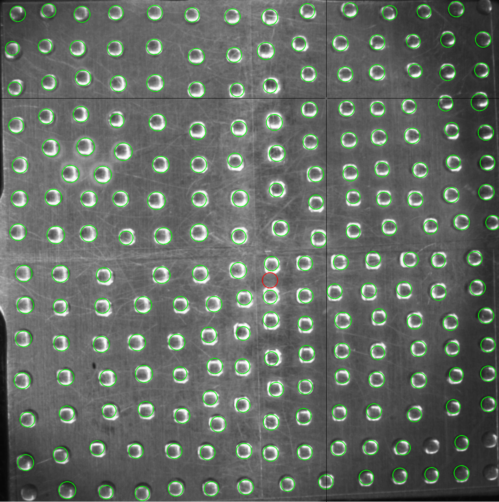

# Drop-Freezing-Detection
MATLAB code to analyze drop freezing spectra from ice nucleation cold-stage measurements. The code was tested using MATLAB 2018b.

# Background
This code is used to analyze observed freeze events of droplets placed on the NC State cold-stage instrument. The instrument was first introduced in Wright and Petters (2013). Early experiments with the instruments used ~100 um diameter droplets immersed in oil and a computer algorithm was needed to identify freeze events. Data from oil immersion experiments are published in a number of manuscripts (Wright and Petters, 2013; Wright et al., 2013, Wright et al., 2014, Hader et al., 2014, Hiranuma et al., 2015, Petters and Wright, 2015, DeMott et al., 2017). Starting with Hader et al. (2014) our group included larger drops (~700 um) also immersed in oil. Subsequently, we replaced the oil with a hydrophobic glass slide and used 1 ul volume drops. Experiments with these larger drop experiments are reported in DeMott et al. (2017, 2018) and Hiranuma et al. (2019) and manuscripts in preparation.

The code in this repository is used for analysis of the 1 ul volume drops. The code consists of a preprocessor to identify drops on the slide and a user-guided validation module. An example set of experimental data collected by Shweta Yadav is included. The analysis code was continually developed by Timothy Wright and Markus Petters between 2012 and 2017 and is made available here under the GPL v3 license. Automatic drop-detection is based on the code by Young (2016), which is redestributed in the folder ```src/circle_hough/``` under it's own license.

# Operational concept
Drop freezing detection occurs by sequentially comparing images of the drops on a cold stage with forward movement in time leading to colder temperatures. Each image is compared to the next colder image with a darkening of the drop indicating a freeze event. Detection occurs in three steps. First, drop locations are identified in the first image in the sequence using a Hough transform for circles. After the location of the drops is identified, each drop location is compared to the same location in the next image by taking a subset (called a tile) of the image including the drop and then performing the following steps: convert the two tiles to grayscale equivalents, subtract the two tiles from each other, convert the grayscale result to a binary image based on a threshold value, and finally perform cleanup (erode/dilate the tile). If the resulting tile has any detected pixels left in it, a freeze event likely occurred in the time between the two image captures. A final manual validation step occurs to ensure that no false positives were detected.   

# Documentation
For the purposes of this code, raw data is called ```level 1```. Analysis produces two additional levels of data. Data in ```level 2``` contains a Matlab data file (```.mat```) file. Two variables are contained within the data file, one for each unprocessed and processed drops. Data for ```level 3``` is the combined experiment data across all runs in two files, a text file containing the resulting IN spectra and a ```png``` image plot of the result in fraction frozen and IN concentration per picoliter of sample water space. Entry point of the code is in the script ```src/process.m```. Raw image data are in ```src/level 1/``` and grouped by experiment number and repeat. Meta data for the experiment are collected inside a data structure the script ```src/process.m```.

Below is an excerpt from the ```process.m``` file. This snippet of code shows the formatting for meta data required for the experiments. Users can modify this block or append array elements to the ```meta``` structure.

```MATLAB
meta(1).pre = 'Experiment 1';                         % Sample prefix
meta(1).files = {'Experiment 1a'; 'Experiment 1b'};   % Experiment repeats
meta(1).repeats = 2;                                  % Number of repeats
meta(1).sampleType = 'Dust suspension';               % Type of sample
meta(1).dateCollected = 'mm-dd-yyyy (hh:mm - hh:mm)'; % Dates sample collected
meta(1).analyzed = {'mm-dd-yyyy';'mm-dd-yyyy'};       % Date each sample was analyzed
meta(1).validated = {'mm-dd-yyyy';'mm-dd-yyyy'};      % Date data were validated
meta(1).Vdrop = 1e-6;                                 % Drop volume (L)
meta(1).coolingRate = 2;                              % Cooling rate (K min-1)
meta(1).originator = 'Shweta Yadav';                  % Person who analzed the data
meta(1).out = 'level 3/';                             % Output of processed data
```

Processing involves two steps. First the raw images are analyzed using the following construct

```MATLAB
m = meta(1); file = m.files{2};         % Select meta block and repeat number
process_level1(['level 1/' file '/'], ['level 2/' file '/'], ...
    'identifyDropsManually', false, 'sensitivityAdjust', 0.9);
```

There are two methods to detect drops in the image. The option

```MATLAB
'identifyDropsManually', true
```

allows the user to select droplets manually by using a left-click on each drop. Once all drops are identified using a right click will start the image processing.

```MATLAB
'identifyDropsManually', false
```
will attempt identification of the drops using a Hough circle transform of the comparison between two images (unfrozen/first and frozen/last) and place circles on the image to indicate found locations and radius of drops. Not all drops are identified and some will be misidentified. The code provides step-by step instructions to add and/or remove false positives using a series of mouse left clicks to select/deselect and right click to move to the next processing step. The drop identification is performed in the script ```src/find_drops.m```



<b> Figure 1. </b> Automatic drop detection via the Hough transform (green circles). The initial pass missed 5 drops (in the corners of the image) that do not have a green circle associated with them. These were not manually correct for illustration. The red circle shows a false positive that has been corrected by the user.

Once drops are identified the code searches through the image stack to identify changes in grey-scale that may be due to a freeze event. The aggressiveness of the detection depends on the ```sensitivityAdjust``` parameter. The parameter ranges from 0.9 to 0.99 with a lower number allowing more drops to be detected along with more false positives.

```MATLAB
'sensitivityAdjust', 0.9
```

The software stack detects grey-scale changes for each drop. If more than one change in grey-scale is detected the user can left click on the drop they believe froze. The top left shows the temperature associated with each image. In the example below, the freeze event is in the middle panel. If the user believes the software completely misidentified a scene, a right-click on the image will toss the data point.


<b> Figure 2. </b> Drop validation. Three changes in the image were detected between the left and right image. For each detected event, the top images correspond to the visual tile of the drop. The bottom image pair corresponds to the computed ```graythresh(diff) + sensitivityAdjust``` of the image. The image analysis is performed in ```src/parse_drops.m```

Once all drops are validated, a file called ```level 2/.../verifiedDrops.mat``` is generated to be loaded for later analysis. The procedure is repeated for repeat experiments (same sample, new set of drops). In this code example, two repeat experiments of a dust suspension are included. Finally, once all repeats have been validated level 2 processing can proceed via the script ```src/process_level2```

```MATLAB
bp = 'level 2/';                       % Path to validated level 1 data
m = meta(1);                           % Selected Experiment meta block
process_level2(bp, m)                  % Collate the data
```

This script collates the data from all repeats and bins the data, generates a quicklook. In the provided examples, the results are in ```level 3/Experiment 1.txt``` and a ```level 3/Experiment 1.png``` data files. The exported text file includes the binned data and appropriate meta data for archiving.


<b> Figure 3. </b> Quicklook for the two repeat experiments. Left, fraction frozen vs. temperature for repeat 1 and repeat 2. Right, same data converted to ice nuclei concentration per L water based on the drop volume. Black squares and error bars correspond to 1 degree binning of the data.


# Acknowledgments

This work was supported by the United States National Science Foundation, Grant numbers AGS-1010851 and AGS-1450690. We thank Dr. Shweta Yadav for collecting the data and suggesting improvements to the code.

The Hough transform for circles functionality was provided by David Young via Math Works File Exchange (Young, 2016). This work includes version 1.2.0.0 of the code.

# References

DeMott, P. J., Hill, T. C. J., Petters, M. D., Bertram, A. K., Tobo, Y., Mason, R. H., Suski, K. J., McCluskey, C. S., Levin, E. J. T., Schill, G. P., Boose, Y., Rauker, A. M., Miller, A. J., Zaragoza, J., Rocci, K., Rothfuss, N. E., Taylor, H. P., Hader, J. D., Chou, C., Huffman, J. A., Pöschl, U., Prenni, A. J., and Kreidenweis, S. M., *Comparative measurements of ambient atmospheric concentrations of ice nucleating particles using multiple immersion freezing methods and a continuous flow diffusion chamber*, Atmos. Chem. Phys., 17, 11227-11245, doi:10.5194/acp-17-11227-2017, (2017).

DeMott, P. J., Möhler, O., Cziczo, D. J., Hiranuma, N., Petters, M. D., Petters, S. S., Belosi, F., Bingemer, H. G., Brooks, S. D., Budke, C., Burkert-Kohn, M., Collier, K. N., Danielczok, A., Eppers, O., Felgitsch, L., Garimella, S., Grothe, H., Herenz, P., Hill, T. C. J., Höhler, K., Kanji, Z. A., Kiselev, A., Koop, T., Kristensen, T. B., Krüger, K., Kulkarni, G., Levin, E. J. T., Murray, B. J., Nicosia, A., O'Sullivan, D., Peckaus, A., Polen, M. J., Price, H. C., Reicher, N., Rothenberg, D. A., Rudich, Y., Santachiara, G., Schiebel, T., Schrod, J., Seifried, T. M., Stratmann, F., Sullivan, R. C., Suski, K. J., Szakáll, M., Taylor, H. P., Ullrich, R., Vergara-Temprado, J., Wagner, R., Whale, T. F., Weber, D., Welti, A., Wilson, T. W., Wolf, M. J., and Zenker, J., *The Fifth International Workshop on Ice Nucleation phase 2 (FIN-02): Laboratory intercomparison of ice nucleation measurements*, Atmos. Meas. Tech., 11 (11), 6231-6257, https://doi.org/10.5194/amt-2018-191, (2018).

Hader, J. D., T. P. Wright, and M. D. Petters, *Contribution of pollen to atmospheric ice nuclei concentrations*, Atmos. Chem. Phys., 14(11), 5,433–5,449, doi:10.5194/acp-14-5433-2014, (2014).

Hiranuma, N., S. Augustin-Bauditz, H. Bingemer, C. Budke, J. Curtius, A. Danielczok, K. Diehl, K. Dreischmeier, M. Ebert, F. Frank, N. Hoffmann, K. Kandler, A. Kiselev, T. Koop, T. Leisner, O. Möhler, B. Nillius, A. Peckhous, D. Rose, S. Weinbruch, H. Wex, Y. Boose, P. J. DeMott, J. D. Hader, T. C. J. Hill, Z. A. Kanji, G. Kulkarni, E. J. T. Levin, C. S. McCluskey, M. Murakami, B. J. Murray, D. Niedermeier, M. D. Petters, D. O’Sullivan, A. Saito, G. P. Schill, T. Tajiri, M. A. Tolbert, A. Welti, T. F. Whale, T. P. Wright, and K. Yamashita, *A comprehensive laboratory study on the immersion freezing behavior of illite NX particles: a comparison of seventeen ice nucleation measurement techniques*, Atmos. Chem. Phys., 15, 2,489–2,518,doi:10.5194/acp-15-2489-2015, (2015).

Hiranuma, N., Adachi, K., Bell, D. M., Belosi, F., Beydoun, H., Bhaduri, B., Bingemer, H., Budke, C., Clemen, H.-C., Conen, F., Cory, K. M., Curtius, J., DeMott, P. J., Eppers, O., Grawe, S., Hartmann, S., Hoffmann, N., Höhler, K., Jantsch, E., Kiselev, A., Koop, T., Kulkarni, G., Mayer, A., Murakami, M., Murray, B. J., Nicosia, A., Petters, M. D., Piazza, M., Polen, M., Reicher, N., Rudich, Y., Saito, A., Santachiara, G., Schiebel, T., Schill, G. P., Schneider, J., Segev, L., Stopelli, E., Sullivan, R. C., Suski, K., Szakáll, M., Tajiri, T., Taylor, H., Tobo, Y., Ullrich, R., Weber, D., Wex, H., Whale, T. F., Whiteside, C. L., Yamashita, K., Zelenyuk, A., and Möhler, O., *A comprehensive characterization of ice nucleation by three different types of cellulose particles immersed in water*, Atmos. Chem. Phys., 19, 4823-4849, https://doi.org/10.5194/acp-19-4823-2019, (2019).

Petters, M. D., and T. P. Wright (2015), *Revisiting ice nucleation from precipitation samples, Geophys. Res. Lett.*, 42(20), 8,758–8,766, doi:10.1002/2015GL065733, (2015).

Wright, T. P. and M. D. Petters, *The role of time in heterogeneous freezing nucleation*, J. Geophys. Res., 118(9), 3,731–3,743, doi:10.1002/jgrd.50365, (2013a).

Wright, T. P., Petters, M. D., Hader, J. D., Morton, T., & Holder, A. L., *Minimal cooling-rate dependence of ice nuclei activity in the immersion mode*, J. Geophys. Res. Atmos., 118(2), 1–9. https://doi.org/10.1002/jgrd.50810, (2013b).

Wright, T. P., J. D. Hader, G. R. McMeeking, M. D. Petters, *High relative humidity as a trigger for widespread release of ice nuclei*, Aerosol Sci. & Technol., 48(11), i–v, doi:10.1080/02786826.2014.968244, (2014).

Young, David, *Hough transform for circles* (https://www.mathworks.com/matlabcentral/fileexchange/26978-hough-transform-for-circles), MATLAB Central File Exchange. Retrieved November 24, 2017, (2016).
